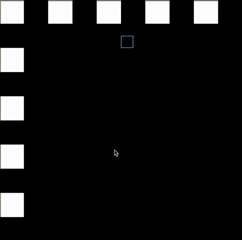

# Game-Of-Life-Keyboard-Implementation
The main version is in a private repo and can only be configured on certain linux machines. However, the adaptation of John Conway's Game of Life prototype using keyboard controls using the SDL library still exists.

## Showcase

## Installation
Using GCC or any C compiler, link and compile all files

For Mac users: Type "./gol" in the directory

## How to Play
Move around using the arrow keys
Press spacebar to plant a cell
Press enter to play/pause the animation

Note: You cannot plant a cell and play the animation at the same time

